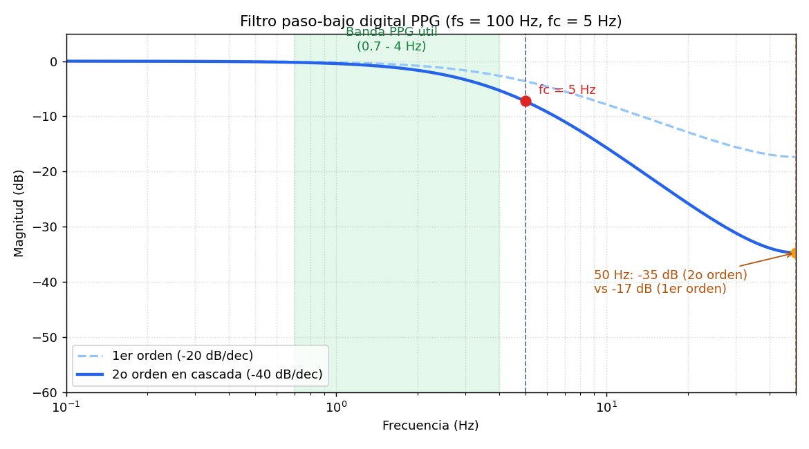
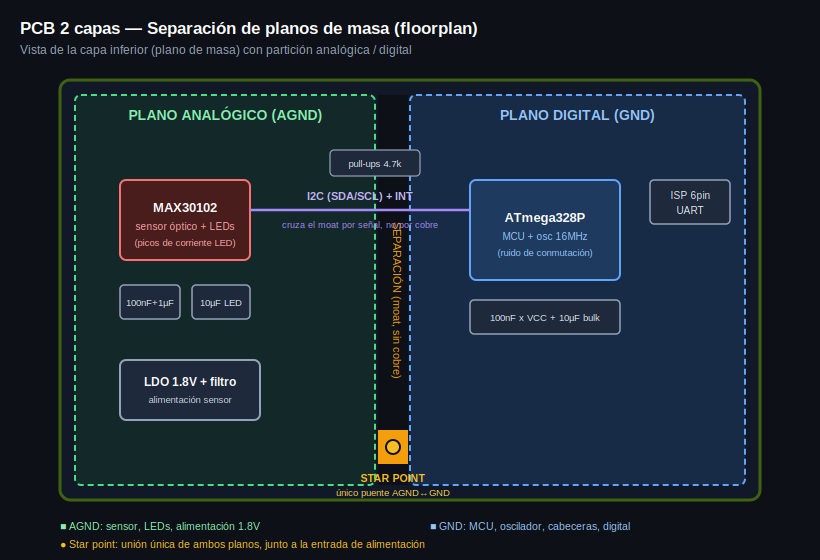
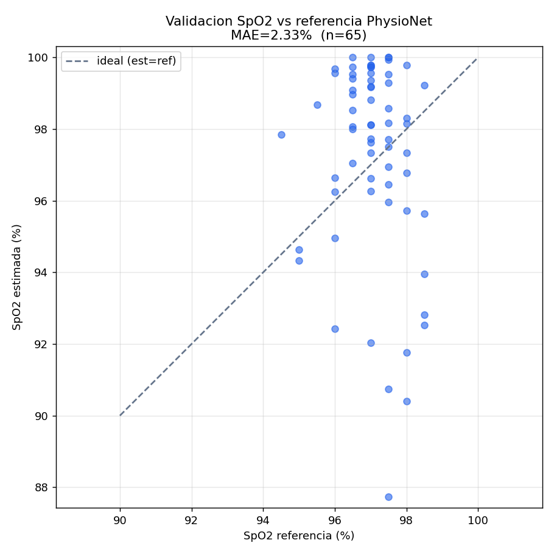

# Pulsioxímetro SpO2 embebido — ATmega328 bare-metal + DSP en punto fijo

Dispositivo de adquisición de señal SpO2 (pulsioximetría) sobre ATmega328
programado en C bare-metal, con el algoritmo ratio-of-ratios implementado en
punto fijo. Incluye el diseño hardware en KiCad (PCB 2 capas con separación de
planos de masa), el firmware no bloqueante (I2C + Timer/ISR) y la validación
del algoritmo contra un dataset clínico de PhysioNet.

Resultados medidos (no estimados):

- **SRAM: -49%** y **Flash: -13%** frente a la versión en coma flotante (medido con avr-gcc en ATmega328P).
- **Error de SpO2: MAE 2.1% en reposo** (2.34% global) frente a la referencia clínica del dataset PhysioNet PTT-PPG, n=65.

## Alcance y honestidad del proyecto

No dispongo del sensor físico, así que la validación se hace sobre señal real
de un dataset, no sobre mediciones propias en un dedo. Conviene tener claro qué
se valida con qué:

- El **algoritmo** (ratio-of-ratios en punto fijo) se valida numéricamente contra las señales rojo/IR reales del dataset PTT-PPG, cuyo sensor (MAX30101) es de la misma familia que el MAX30102 del diseño.
- El **firmware** (I2C bare-metal, Timer/ISR) se entrega y se verifica funcionalmente: compila para el ATmega328 y su arquitectura es la que correría en el hardware.
- El **hardware** (esquemático y PCB en KiCad) se documenta como diseño con su justificación técnica.

No mezclo las tres cosas: el número de error viene del algoritmo contra el
dataset, no de un cacharro midiendo dedos.

## Cómo funciona un pulsioxímetro

Dos LEDs (rojo e infrarrojo) iluminan el dedo y un fotodiodo mide cuánta luz
sale al otro lado. La sangre oxigenada absorbe el rojo y el infrarrojo en
proporciones distintas a la desoxigenada, así que comparando cuánto pulsa cada
color se estima el % de oxígeno. Con cada latido entra un chorro de sangre
arterial, lo que hace que la señal tenga una parte que "late" (la AC, ~1-2% del
total) montada sobre una parte constante (la DC).

## Algoritmo: ratio-of-ratios

```
R = (AC_red / DC_red) / (AC_ir / DC_ir)
SpO2 = 110 - 25*R      (curva de calibración estándar)
```

Normalizar cada canal por su DC elimina las diferencias de intensidad de LED,
grosor de dedo y tono de piel. Los coeficientes 110 y 25 son la calibración
empírica estándar; no la recalibro (no tengo gasometría de referencia), y eso
limita el error absoluto alcanzable. Lo digo claro en vez de esconderlo.

## Acondicionamiento: filtro paso-bajo digital 5 Hz

El MAX30102 es un módulo digital (ADC y FIFO van dentro, sale por I2C), así que
no hay señal analógica accesible donde meter un RC físico: el filtrado se hace
en firmware. Uso un paso-bajo a 5 Hz porque el pulso y sus armónicos útiles
viven por debajo de esa frecuencia; por encima solo hay ruido (red de 50 Hz,
conmutación de LEDs, artefactos de movimiento).



Detalle de diseño: la primera versión era un IIR de 1er orden, pero solo atenúa
17 dB a 50 Hz, que es flojo. Pasé a 2o orden (dos etapas en cascada) y sube a
35 dB, manteniendo plana la banda del pulso. El coeficiente a=0.2391 se
convierte a Q15 como 7833 para el punto fijo.

## Hardware: PCB 2 capas con separación de planos de masa



Plano de masa partido en dos regiones (AGND analógica para sensor/LEDs/
alimentación, GND digital para MCU) unidas en un único punto (star point) junto
a la entrada de alimentación. Ninguna señal cruza el foso salvo por ese punto.

Nota honesta de diseño: con un sensor digital como el MAX30102 la separación de
planos es menos crítica que con un front-end analógico discreto, porque no hay
señal analógica sensible viajando por la placa. Aquí su función real es contener
los picos de corriente de los LEDs, que al pulsar contaminan la referencia del
MCU. Aplico la técnica entendiendo para qué sirve en este caso concreto.

## Firmware: 100% no bloqueante

El muestreo lo marca el Timer1 en modo CTC, configurado por registros para
disparar cada 10.000 ms exactos (prescaler 8, OCR1A=19999). La ISR solo levanta
una bandera; el trabajo pesado (leer la FIFO por I2C, procesar) lo hace el main
al verla. Cero delay() en toda la aplicación: así el disparo es determinista
pase lo que pase con el procesado.

El bus I2C va a 400 kHz. Lo probé primero a 100 kHz y la FIFO del sensor se
llenaba antes de poder vaciarla (overflow, pérdida de muestras), lo que rompe el
muestreo determinista aunque el Timer sea perfecto. A 400 kHz resuelto.

## Punto fijo: de dónde sale el ahorro de memoria

La métrica de memoria la medí compilando ambas versiones con avr-gcc para el
ATmega328P (`firmware/benchmark`, reproducible con `make sizes`):

| Métrica       | Float  | Fixed (Q15, int16) | Reducción |
|---------------|--------|--------------------|-----------|
| Flash (text)  | 2086 B | 1808 B             | -13.3%    |
| SRAM (bss)    | 1045 B |  531 B             | -49.2%    |
| Error vs float| -      | -                  | ~0.01 pp  |

Lección importante: el ahorro de SRAM no viene de "usar punto fijo" sin más,
viene de una decisión concreta: guardar la AC en int16 en vez de float/int32.
La AC es ~1-2% de la DC, cabe de sobra en 16 bits. Una primera versión con
buffers int32 y raíz entera me salía MÁS grande en Flash que la float; el punto
fijo es lo que permite usar int16 sin perder precisión (verificado: 0.01 puntos
porcentuales frente a float sobre señal sintética).

## Validación contra dataset clínico

Validé el algoritmo contra el dataset PhysioNet Pulse Transit Time PPG (66
registros, 22 sujetos, sensor MAX30101). El script (`dsp/validacion.py`)
descarga cada registro, decima de 500 a 100 Hz, aplica el mismo pipeline del
firmware y compara con la SpO2 de referencia de cada cabecera.



| Condición        | n  | MAE   | RMSE  | Error máx |
|------------------|----|-------|-------|-----------|
| SIT (reposo)     | 22 | 2.14% | 2.49% | 5.0%      |
| WALK             | 22 | 2.80% | 3.73% | 9.8%      |
| RUN              | 21 | 2.06% | 2.71% | 6.7%      |
| Global           | 65 | 2.34% | 3.03% | 9.8%      |

Limitaciones que hay que tener en cuenta:

- Los sujetos son sanos, así que la referencia está casi toda en 96-99%. Esto mide precisión en rango normal, no en hipoxia. No hay datos de SpO2 baja para probar el rango bajo.
- La referencia del dataset es puntual (inicio y fin de cada actividad), no continua, así que hay pocos puntos de comparación por registro.
- El peor error está en WALK (movimiento), como era de esperar por los artefactos de movimiento. Es coherente con que el filtrado y la medida en reposo importan.

El MAE en reposo (2.1%) está en línea con lo que da el ratio-of-ratios clásico
sobre datasets públicos.

## Estructura del repositorio

```
.
├── README.md
├── firmware/
│   ├── main.c            # bucle no bloqueante
│   ├── i2c.c / i2c.h     # TWI bare-metal + registros MAX30102
│   ├── timer.c / timer.h # Timer1 CTC 100Hz + ISR
│   └── benchmark/        # float vs fixed, medida de SRAM/Flash
├── dsp/
│   └── validacion.py     # validación contra dataset PhysioNet
├── hardware/             # esquemático y PCB KiCad (+ capturas)
└── media/
    ├── respuesta_filtro.png
    ├── plano_masas.svg
    └── validacion_spo2.png
```

## Reproducir

Métrica de memoria (necesita gcc-avr y avr-libc):
```
cd firmware/benchmark && make sizes
```

Validación (necesita python con wfdb, numpy, scipy, matplotlib):
```
python dsp/validacion.py
```
